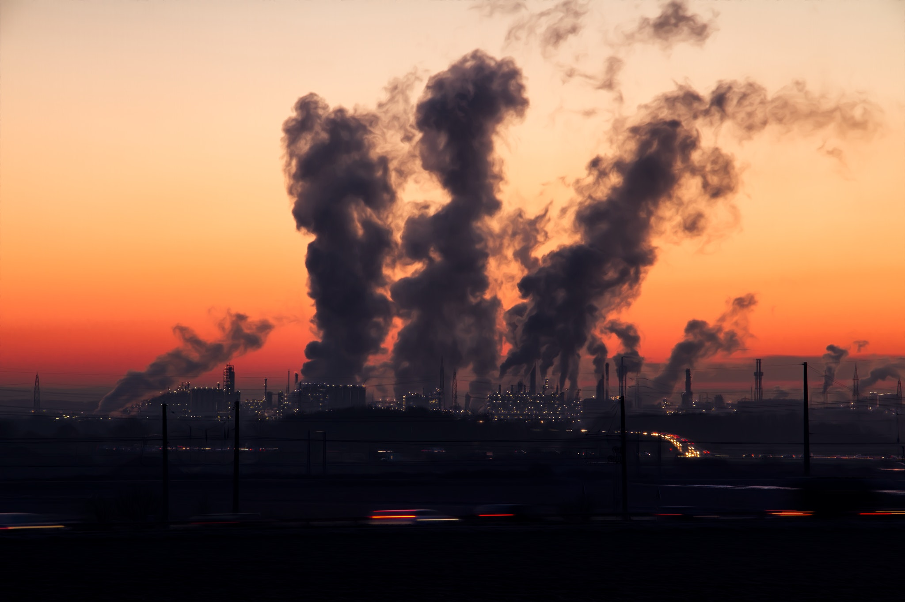
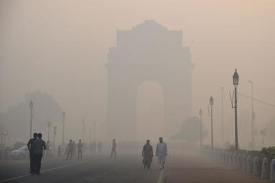

# Air-Quality-Prediction-System
 
India has made it to the headlines when it comes to air pollution. The growing air pollution in the country has been one of the major concerns for both the government and the citizens.  Many actions have been taken by the government to control polution, but still the problem stands.  Air pollution is a major problem and should not be ignored. Most of the population is not even aware of the colossal harm caused by the air they breathe everyday.  Being a data science and analysis enthusiast I decided to analyze the Indian air quality data to find something meaningful and to make people aware by the facts and figures.
Air pollution is one of the major hazards among the environmental pollution. As each living organism needs fresh and good quality air for every second. None of the living things can survive without such air. But because of automobiles, agricultural asctivities, factories and industries, mining activities, burning of fossil fuels our air is getting polluted. These activities spread sulphur dioxide, nitrogen dioxide, carbon monoxide, particulate matter pollutants in our air which is harmful for all living organism. The air we breathe every moment causes several health issues. So we need a good system that predicts such pollutions and is helpful in better environment. It leads us to look for advance techniques for predicting the air pollution. 

The main focus of this project is learning about modeling of data by supervised algorithms i.e (Linear Regression (regression), Logistic Regression, Random Forest Classifer, Decision Tree Classifier (classification)). The main focus of this particular project is AQI(Air Quality Index), and factors that affects AQI i.e (so2, no2, spm, rspm,). In this project a basic data analysis is done on India Air Quality data and the value of Air Quality Index based on given features of concentration of sulphur dioxide, nitrogen dioxide, respirable suspended particulate matter, suspended particulate matter were predicted and classification of the Air Quality as good, satisfactory, moderately polluted, poor, very poor and severe was done.

## THE DATA

The dataset contains the following features :

1. stn_code : Station code. A code given to each station that made the measurements.

2. sampling_date : The date when the data was recorded.

3. state : It represents the states whose air quality data is measured.

4. location : It represents the city whose air quality data is measured.

5. agency : Name of the agency that measured the data.

6. type : The type of area where the measurement was made.

7. so2 : The amount of Sulphur Dioxide measured.

8. no2 : The amount of Nitrogen Dioxide measured.

9. rspm : Respirable Suspended Particulate Matter measured.

10. spm : Suspended Particulate Matter measured.

11. location_monitoring_station : It indicates the location of the monitoring area.

12. pm2_5 : It represents the value of particulate matter measured.

13. date : It represents the date of recording (It is cleaner version of 'sampling_date' feature)
